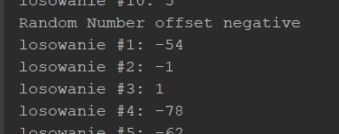
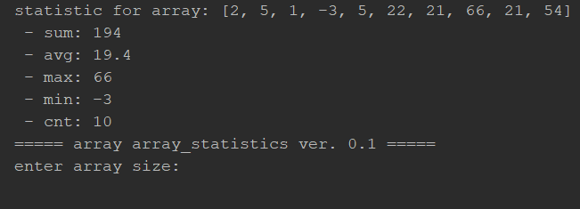
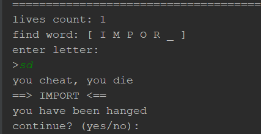
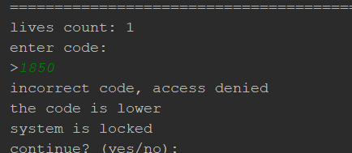
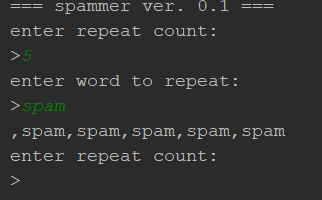

# SDA - extra

projekt utworzony na potrzeby zrobienia zadań dodatkowych zleconych przez trenera.
Każdy pakiet jest jednym zadaniem i zawiera swóją klasę uruchomieniową.
  

# Zadania

## random_number

Utworzenie klasy drukującej losową liczbę w zadanym przez użytkownika zakresie.
1. Użytkownik deklaruje maksymalną liczbę (losowanie odbywa się od liczby zera do liczby maksymalnej zdefiniowanej przez użytkownika) np.
- Użytkownik wpisuje ‘10’ -> liczba losowa przyjmuje wartość od 0 do 10
2. Użytkownik deklaruje minimalną liczbę oraz maksymalną 
- Dla liczby ‘1’ i ‘100’ -> liczba losowa przyjmuje wartość od 1 do 100
3. Użytkownik może podawać liczby ujemne
- Dla liczb: ‘-100’ i ‘5’ -> liczba losowa przyjmuje wartość od -100 do 5
 

## array_statistics

Utworzenie klasy, opisującej statystyki dla tablicy typu liczbowego
1. Utworzenie 2 metod:
- Psvm1.
  - Zadeklarowana na sztywno tablica z wartościami początkowymi np. int[] tablica = new int[]{2,5,1,-3,5,22,21,66,21,54}
  - Przesłanie tablicy do metody drukujOpisTablicyii.
- drukujOpisTablicy 
  - Metoda drukuje następujące parametry:
    - Minimalna wartość w tablicy
    - Maksymalna wartość w tablicy
    - Średnia wartość tablicyd.Ilość Elementów
  - Dla w/w przykładu oczekujemy poniższego tekstu:
    - Min wartość: -3
    - Max wartość: 66
    - Średnia wartość: 19.4
    - Ilość elementów: 10
  - Rozszerzenie o podawanie tablicy z palca przez użytkownika (pętla for) – np. iloelementową tablicę chcesz utworzyć? Pobrać wartość i zadeklarować tablicę, która następnie można uzupełnić w pętli for
  - Po wypisaniu podsumowania tablicy zapytać użytkownika czy chce kontynuować (tak/nie) –jeśli tak ponownie wczytać i wyświetlić parametry tablicyd.
  - Jeśli użytkownik poda wartość spoza zakresu zadać pytanie ponownie i wyświetlić tekst: „Podano nieprawidłową odpowiedź, proszę wpisać ‘tak’ lub ‘nie’.  
  \

## hangman

Napisz program ‘wisielec’ –użytkownik ma 5 żyć, użytkownik może podać jedynie 1 literę –gdy poda więcej przegrywa grę. Jeśli poda literę spoza hasła, traci jedno życie, gdy zostanie bez żyć <0 przegrywa grę.
- Użytkownik sam wpisuje hasło dla przeciwnika
- Hasło jest losowane z słownika czyli tablicy haseł
- Po zakończeniu gry –zapytanie do użytkownika czy chce kontynuować dalej grę (t/n)

## crypto_breaker

Szyfrołamacz –użytkownik musi odgadnąć 4 cyfrowe hasło, ma 5 żyć, po podaniu hasła program informuje go czy podany kod był większy lub mniejszy od hasła. Po utracie wszystkich żyć program kończy działanie
- Po utracie wszystkich żyć program pyta użytkownika czy chce spróbować ponownie
- Użytkownik może raz w ciągu gry poprosić o podpowiedź która odsłoni jedno z 4 cyfr tajnego hasła

## spammer

Spammer –program pyta użytkownika o słowo oraz ilość powtórzeń wg której ma wyświetlić zadane słowa 
- Metoda void
- 2 argumentowa –Słowo, ilośc powtórzeń
- Do...while (wprowadzone słowo !equals(„”);

